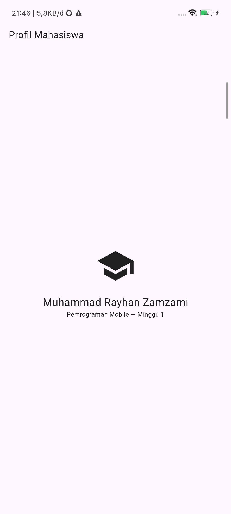
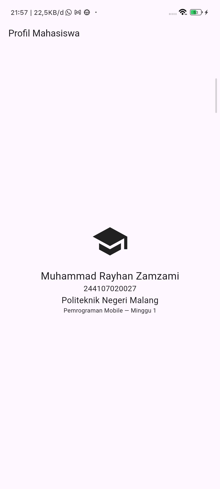

|  | Pemrograman Mobile |
|--|--|
| NIM |  244107020027|
| Nama |  Muhammad Rayhan Zamzami |
| Kelas | TI - 3G |
| Repository | [link] (https://github.com/mrayhanz/244107020027-mobile-course/tree/main/01-week-1-mobile-development-ecosystem-flutter-refresh) |

# WEEK 1
## Mobile Development Ecosystem & Flutter Refresh

### Tujuan

Mempelajari dasar pengembangan aplikasi mobile menggunakan Flutter

### Fitur Utama

1. Menampilkan halaman profil mahasiswa
2. Menampilkan ikon sekolah
3. Menampilkan nama dari mahasiswa
4. Menampilkan mata kuliah
5. Mengubah tampilan UI dari halaman default Flutter

### Stack Teknologi

1. Flutter
2. Android Studio
3. VS Code
4. Git
5. GitHub

### Hasil

### Mini Assignment

menambahkan NIM dan nama kampus

#### Refleksi

    1. Kapan native lebih tepat dipilih daripada cross-platform?
        Native lebih cocok jika aplikasi membutuhkan performa tinggi, fitur perangkat yang spesifik, atau tampilan yang sangat menyesuaikan sistem operasi.

    2. Bagaimana perubahan state berhubungan dengan widget tree dan UI deklaratif?
        Widget tree menampilkan UI berdasarkan kondisi state. Saat state berubah, Flutter memperbarui widget sehingga tampilan mengikuti kondisi terbaru.

    3. Mengapa commit kecil dengan pesan jelas bermanfaat bagi pekerjaan tim dan portfolio?
        Commit kecil lebih mudah dipantau dan diperbaiki, sementara pesan yang jelas membantu orang lain memahami perubahan yang kita buat.