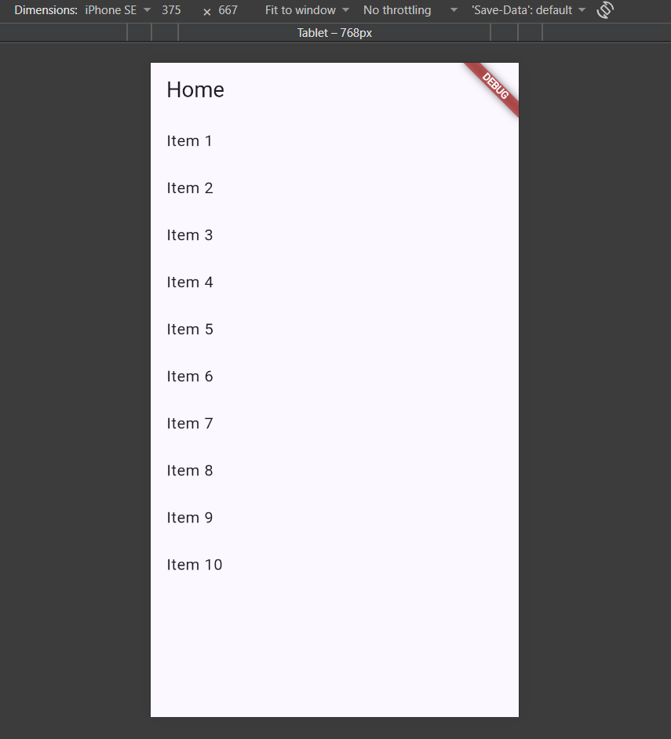
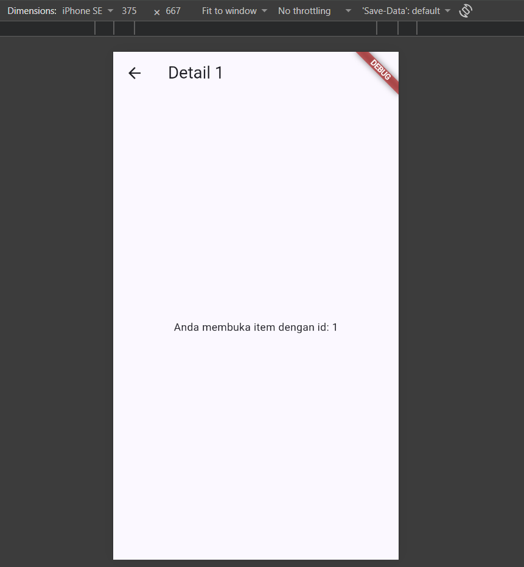
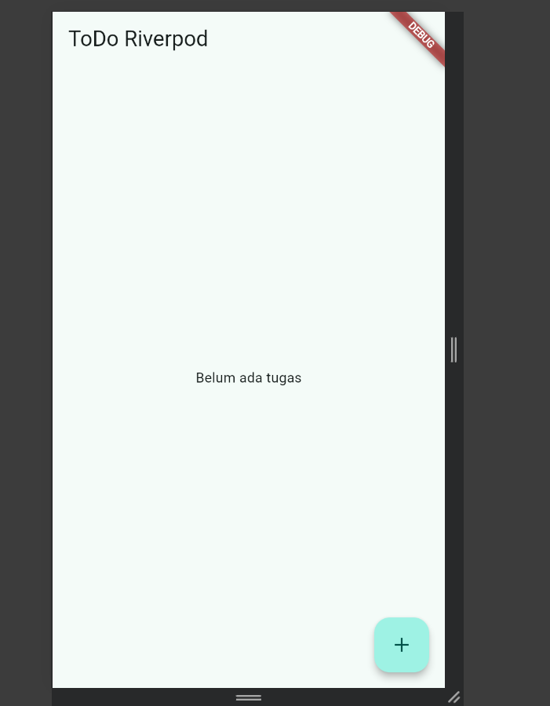
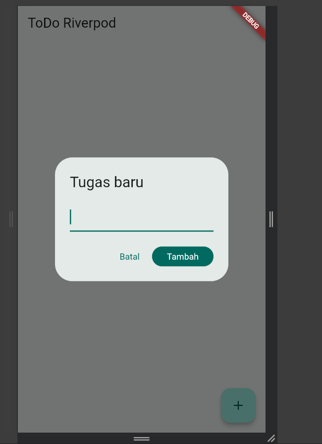
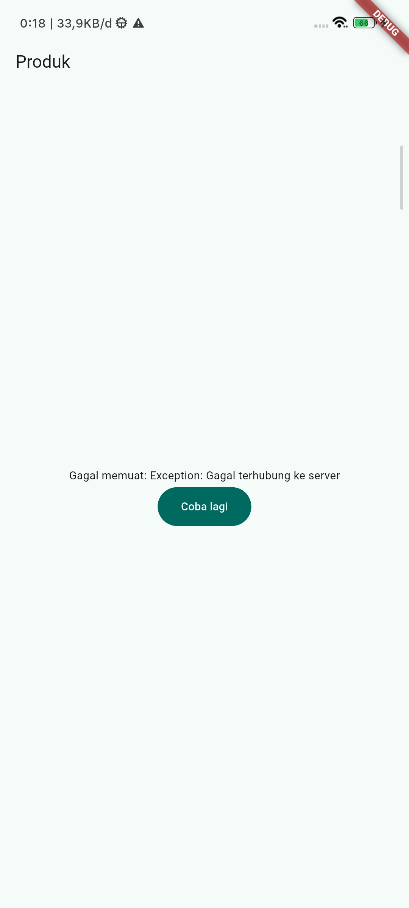
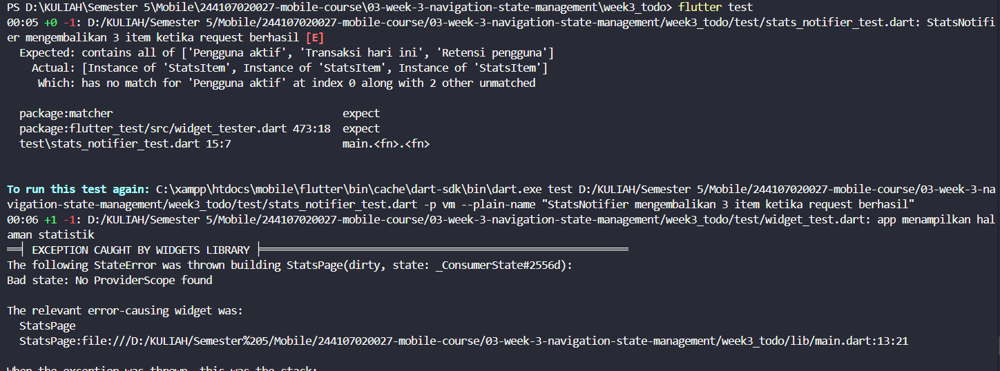
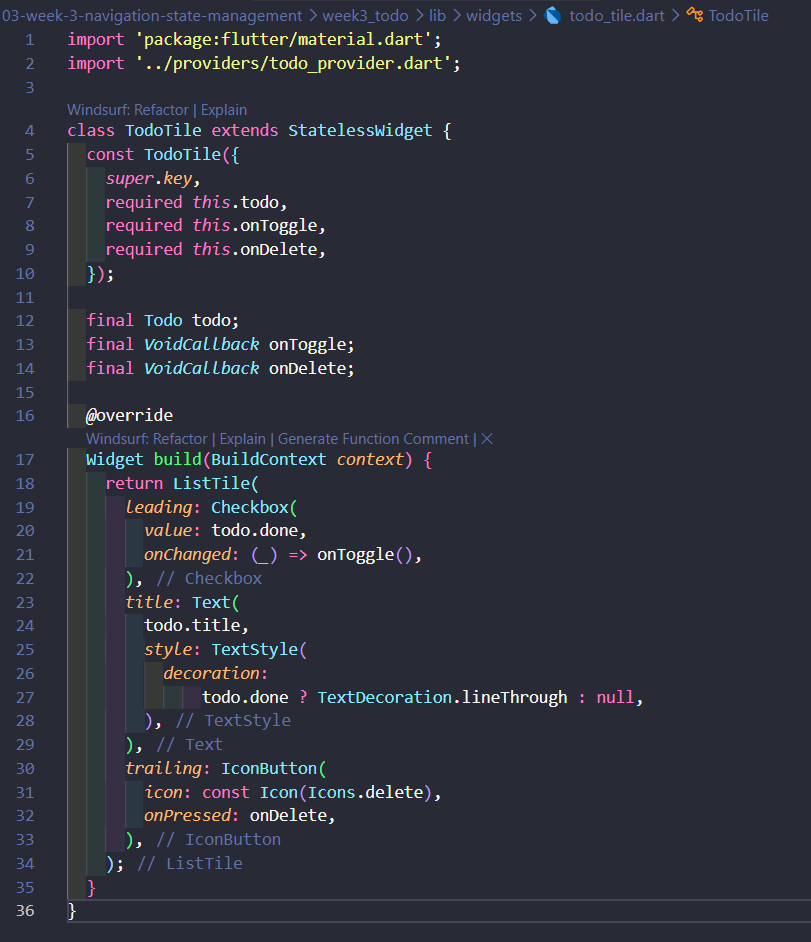
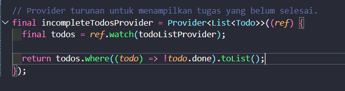
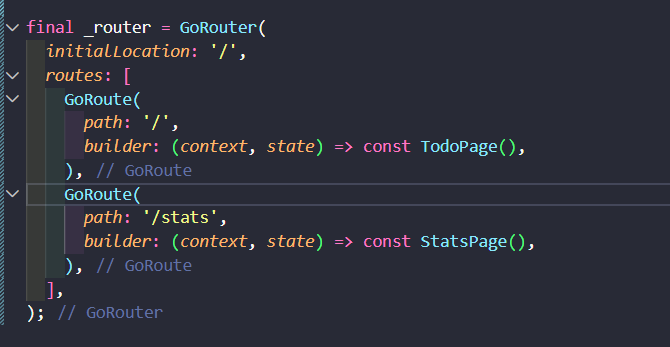
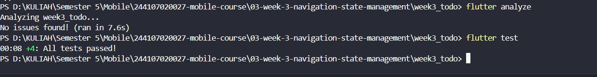

|  | Pemrograman Mobile |
|--|--|
| NIM |  244107020027|
| Nama |  Muhammad Rayhan Zamzami |
| Kelas | TI - 3G |
| Repository | [link] (https://github.com/mrayhanz/244107020027-mobile-course/tree/main/03-week-3-navigation-state-management) |

# WEEK 3
## Navigation & State Management

### PRAKTIKUM 1

### PRAKTIKUM 2

### PRAKTIKUM 3

**Penjelasan** 

Saat Menjalankan Aplikasi Usera kaan melihat lingkarn loading berputar selama beberapa detik lalu memunculkan daftar barang (keyboard, mouse dan monitor)

**Penjelasan** 

Saat (return[keyboard...]) di ganti menjadi Throw exception('gagal terhubung ke server'), maka akan memunculkan pesan yang menunjukan gagal memuat

**Penjelasan** 

Saat klik tombol muat ulang di dalam aplikasi maka akan terload kembali barang yang ada (mouse, keyboard dan komputer)

**Refleksi**

Hal ini berkaitan dengan User Experience (UX). Menampilkan halaman kosong dengan indikator loading yang besar dapat mengganggu kenyamanan pengguna karena membuat mereka kehilangan konteks dari informasi yang sedang dilihat. Sebaliknya, mempertahankan data yang sudah ditampilkan dan hanya menambahkan indikator loading kecil memungkinkan pengguna tetap membaca atau menggunakan konten sebelumnya sambil aplikasi memproses dan mengambil data terbaru.

### AI CHALLENGE

1. Apakah state diubah secara immutable (tidak ada state.add() atau mutasi list langsung)?
    
    Ya. State tidak dimodifikasi dengan state.add() atau mutasi list langsung. Data dikembalikan sebagai nilai baru dari build().

2. Apakah ref.watch hanya dipakai di dalam build, dan ref.read di callback?

    Ya. ref.watch(statsProvider) dipakai di build, dan tidak ada ref.read yang dipakai di halaman. Untuk retry, kode memakai ref.invalidate(...) di callback.

3. Apakah ketiga state AsyncValue benar-benar ditangani (bukan hanya success)?

    Ya. when menangani loading, error, dan data secara eksplisit.

4. Apakah provider dideklarasikan dengan tipe eksplisit dan tidak duplikat dengan provider lain?

    Ya. Provider dideklarasikan sebagai AsyncNotifierProvider<StatsNotifier, List<StatsItem>> dan hanya ada satu

5. Apakah kode AI memakai API Riverpod versi lama (StateProvider antipattern, StateNotifierProvider usang, atau Consumer bertingkat yang tidak perlu)? 
Perbaiki ke pola Notifier/ConsumerWidget.

    Ya sudah diperbaiki ke pola modern. Kode memakai AsyncNotifier dan ConsumerWidget, bukan StateProvider, StateNotifierProvider, atau Consumer bertingkat yang tidak perlu.

6. Jalankan flutter analyze dan flutter test, apakah hasil AI lolos tanpa warning?

    lolos di bagian flutter analyze saja, kalau pada bagian flutter test terdapat warning sebagai berikut
    

### Refactoring dan testing

1. Pisahkan widget bar ToDo menjadi TodoTile tersendiri agar build lebih pendek dan mudah diuji.
    

2. Ekstrak logika filter (misal tampilkan hanya yang belum selesai) menjadi Provider turunan yang membaca todoListProvider.
    

3. Integrasikan aplikasi ToDo dengan GoRouter: / untuk daftar dan /stats untuk halaman statistik, tambahkan NavigationBar untuk berpindah.
    

**TESTING**

### REFLEKSI

1. Kapan setState masih cukup, dan kapan state harus naik ke Riverpod?
    setState cukup untuk state sederhana dalam satu widget, sedangkan Riverpod cocok untuk state yang digunakan beberapa widget atau halaman.

2. Apa perbedaan context.go dan context.push, dan kapan masing-masing tepat digunakan?
    context.go untuk berpindah route utama, sedangkan context.push untuk membuka halaman baru yang masih bisa kembali ke halaman sebelumnya.

3. Bagaimana AsyncValue mencegah bug dibanding tiga boolean terpisah?
    AsyncValue menggabungkan kondisi loading, error, dan data sehingga lebih terstruktur dan mengurangi kemungkinan state yang bertabrakan.

4. Bagian mana dari hasil AI yang Anda perbaiki, dan mengapa?
   Saya memperbaiki struktur Todo, filter Provider, dan navigasi GoRouter agar sesuai dengan requirement praktikum dan kode menjadi lebih terstruktur.