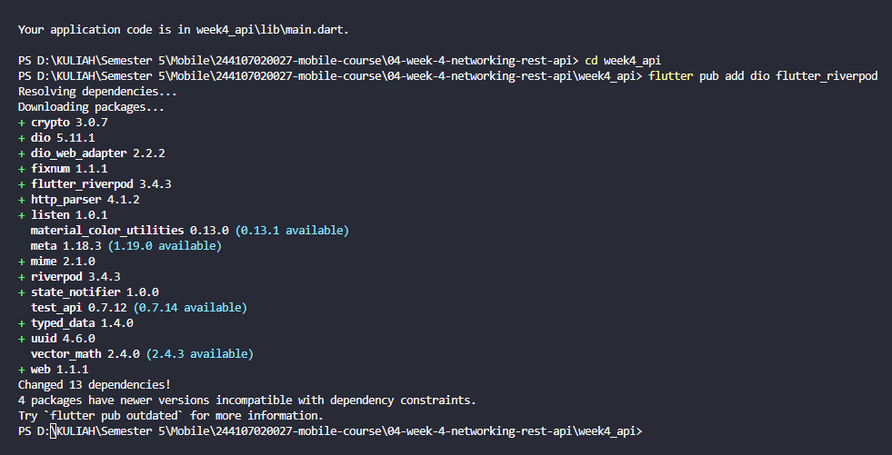
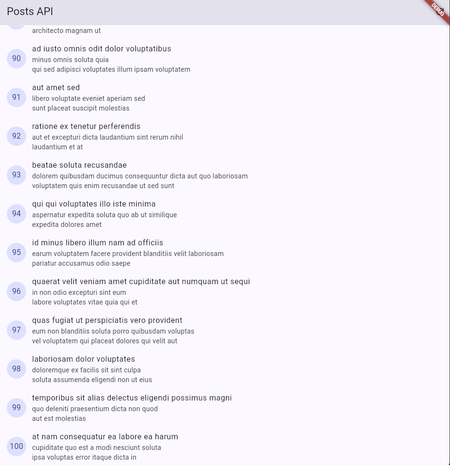
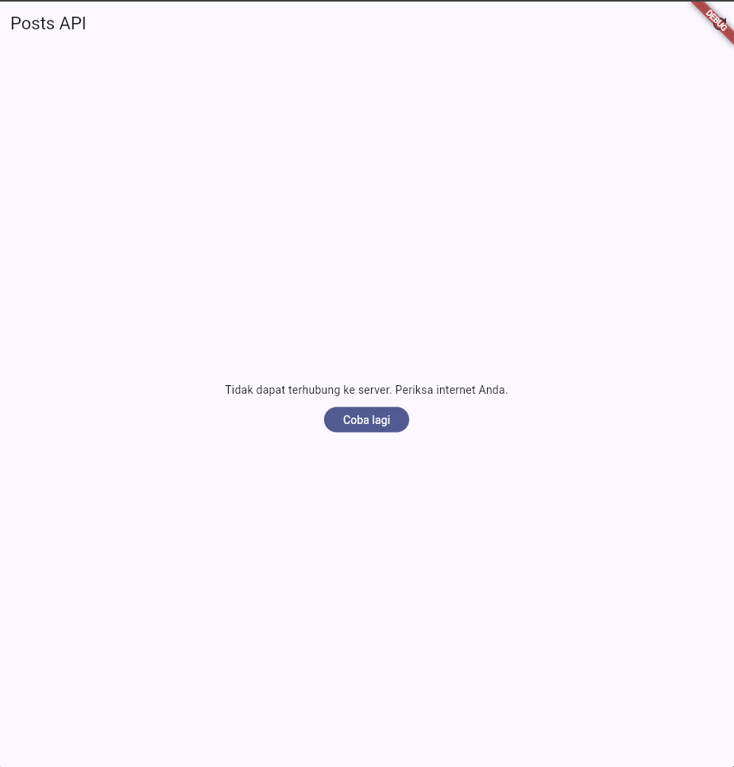
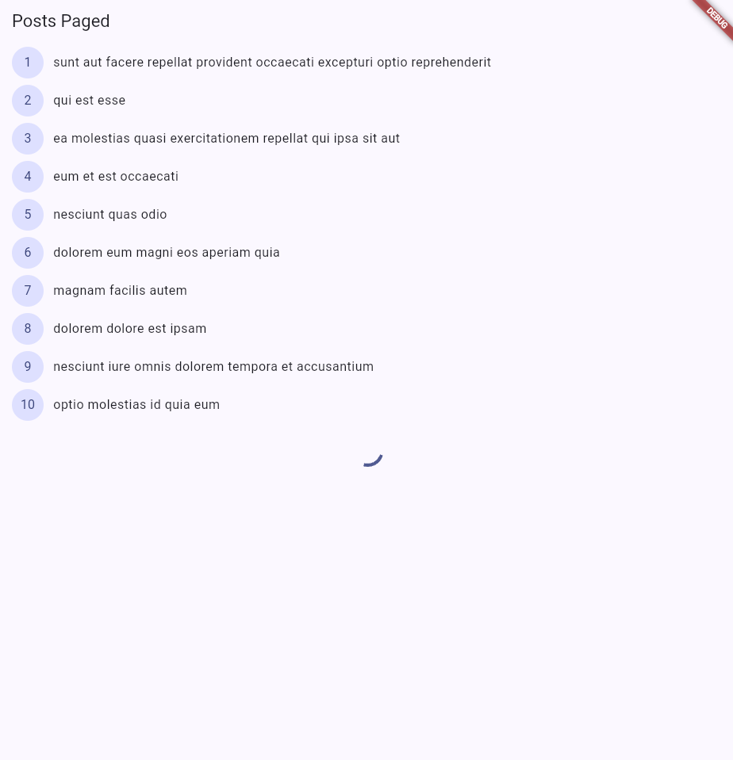
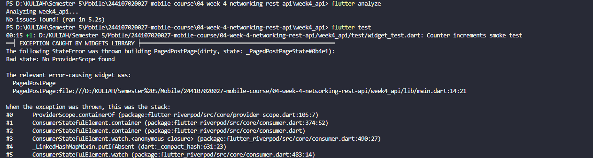
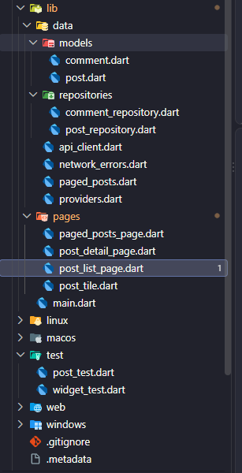
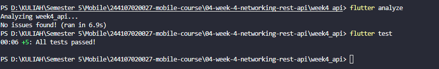

|  | Pemrograman Mobile |
|--|--|
| NIM |  244107020027|
| Nama |  Muhammad Rayhan Zamzami |
| Kelas | TI - 3G |
| Repository | [link] () |

# WEEK 4

## Networking & Rest API

### Praktikum 1



### Praktikum 2

Uji 3 Skenario error : 

1. Jalankan aplikasi dengan internet normal, amati loading lalu daftar 100 posts.



2. Matikan internet (mode pesawat), tekan refresh, amati pesan ramah + tombol Coba lagi. Nyalakan kembali internet, tekan Coba lagi.




3. Sementara ubah baseUrl menjadi URL salah, amati pesan error koneksi. Kembalikan setelah uji.

```
    BaseOptions(
      baseUrl: 'https://jsonplaceholder1.typicode.com',
      connectTimeout: const Duration(seconds: 10),
      receiveTimeout: const Duration(seconds: 10),
      headers: {'Accept': 'application/json'}, 
    ),
```


### Praktikum 3



### AI Challenge

AI Verification Checklist

- Apakah UI memanggil Dio secara langsung (dilarang) atau lewat repository?

  UI tidak panggil Dio langsung. Semua lewat repository/provider.

- Apakah fromJson aman null, atau masih memakai cast langsung yang bisa crash?

  fromJson aman null, pakai fallback ?? 0 / ?? '', bukan cast mentah.

- Apakah semua tipe DioExceptionType (timeout, connectionError, badResponse) dipetakan ke pesan pengguna?

  Error mapping sudah ada untuk timeout, connection error, dan bad response (404/500).

- Apakah baseUrl/timeout terpusat di satu client, bukan tersebar di tiap method?

  baseUrl dan timeout terpusat di satu client di api_client.dart.

- Apakah test AI benar-benar menguji kasus field hilang, atau hanya happy path? Tambahkan minimal 1 edge case sendiri.

  Test sudah ada edge case field hilang di comment_model_test.dart.

- Jalankan flutter analyze dan flutter test, apakah hasil AI lolos tanpa warning?

Tidak lolos saat melakukan flutter test


### Refactoring

1. Ekstrak widget baris post menjadi PostTile tersendiri agar ListView.builder pendek dan mudah diuji.
```
import 'package:flutter/material.dart';
import '../data/models/post.dart';

class PostTile extends StatelessWidget {
  const PostTile({
    super.key,
    required this.post,
  });

  final Post post;

  @override
  Widget build(BuildContext context) {
    return ListTile(
      leading: CircleAvatar(
        child: Text(post.id.toString()),
      ),
      title: Text(
        post.title,
        maxLines: 1,
        overflow: TextOverflow.ellipsis,
      ),
      subtitle: Text(
        post.body,
        maxLines: 2,
        overflow: TextOverflow.ellipsis,
      ),
    );
  }
}

```

2. Pindahkan friendlyErrorMessage ke file lib/data/network_errors.dart agar bisa dipakai ulang halaman paged dan non-paged.

```
import 'package:dio/dio.dart';

String friendlyErrorMessage(Object error) {
  // Fungsi ini menyatukan semua mapping error jaringan agar bisa dipakai
  // di halaman paged maupun non-paged. Dengan cara ini, UI tidak perlu tahu
  // detail DioException dan error tidak tersebar di banyak file.
  if (error is DioException) {
    switch (error.type) {
      case DioExceptionType.connectionTimeout:
      case DioExceptionType.sendTimeout:
      case DioExceptionType.receiveTimeout:
        return 'Waktu koneksi habis. Periksa jaringan Anda lalu coba lagi.';
      case DioExceptionType.connectionError:
        return 'Tidak dapat terhubung ke server. Pastikan internet aktif.';
      case DioExceptionType.badResponse:
        final code = error.response?.statusCode;
        if (code == 404) {
          return 'Data tidak ditemukan (404).';
        }
        if (code == 500) {
          return 'Server sedang bermasalah. Coba beberapa saat lagi.';
        }
        if (code == 401 || code == 403) {
          return 'Akses ditolak ($code). Silakan coba lagi nanti.';
        }
        return 'Server merespons dengan error $code. Coba lagi nanti.';
      default:
        return 'Terjadi kesalahan jaringan. Coba lagi.';
    }
  }

  return 'Terjadi kesalahan tak terduga: $error';
}
```

3. Tambahkan halaman detail post dengan GoRouter (/post/:id) yang menampilkan title dan body lengkap, state detail diambil dari list yang sudah dimuat atau via repository bila langsung dibuka.




### REFLEKSI

1. Mengapa UI dilarang memanggil Dio langsung? Apa yang rusak jika aturan ini dilanggar?
  Karena UI seharusnya hanya mengatur tampilan dan state. Kalau Dio dipanggil langsung di UI, kode jadi sulit dirawat, testing lebih susah, dan logika networking bercampur dengan tampilan.

2. Kapan pagination client-side cukup, dan kapan harus mengandalkan pagination server (_page/_limit)?
  Client-side cukup kalau jumlah data sedikit dan masih aman dimuat sekaligus. Kalau datanya banyak, lebih baik menggunakan pagination server dengan _page dan _limit supaya aplikasi tidak mengambil semua data sekaligus.

3. Bagaimana exception repository berubah menjadi AsyncError tanpa try/catch di setiap widget? Kapan try/catch eksplisit tetap dibutuhkan?
  AsyncNotifier menangani proses async dan error dari repository sehingga state dapat menjadi AsyncError. Try/catch eksplisit tetap dibutuhkan kalau kita ingin melakukan penanganan khusus, seperti menampilkan pesan tertentu atau melakukan recovery dari error.

4. Bagian mana dari hasil AI yang Anda perbaiki, dan mengapa?
  Saya memperbaiki bagian provider, repository, dan testing, terutama menyesuaikan postDetailProvider, pagination, serta ProviderScope pada widget test. Perbaikan dilakukan karena beberapa kode dari AI belum sesuai dengan struktur project dan menyebabkan error saat flutter analyze dan flutter test.