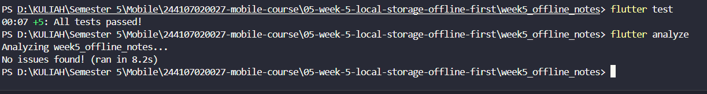

|  | Pemrograman Mobile |
|--|--|
| NIM |  244107020027|
| Nama |  Muhammad Rayhan Zamzami |
| Kelas | TI - 3G |
| Repository | [link] (https://github.com/mrayhanz/244107020027-mobile-course/tree/main/05-week-5-local-storage-offline-first  ) |

# WEEK 5

## Local Storage & Offline First

### Praktikum 1

lib/data/prefs.dart
```
import 'package:shared_preferences/shared_preferences.dart';

class PrefsRepository {
  static const _darkModeKey = 'dark_mode';
  static const _lastOpenedKey = 'last_opened_at';

  Future<bool> getDarkMode() async {
    final prefs = await SharedPreferences.getInstance();
    return prefs.getBool(_darkModeKey) ?? false;
  }

  Future<void> setDarkMode(bool value) async {
    final prefs = await SharedPreferences.getInstance();
    await prefs.setBool(_darkModeKey, value);
  }

  Future<void> markOpenedNow() async {
    final prefs = await SharedPreferences.getInstance();
    await prefs.setString(_lastOpenedKey, DateTime.now().toIso8601String());
  }

  Future<String?> getLastOpened() async {
    final prefs = await SharedPreferences.getInstance();
    return prefs.getString(_lastOpenedKey);
  }
}
```

lib/pages/settings_page.dart
```
mport 'package:flutter/material.dart';
import 'package:flutter_riverpod/flutter_riverpod.dart';
import '../data/prefs.dart';

final prefsRepositoryProvider = Provider((ref) => PrefsRepository());
final darkModeProvider =
    AsyncNotifierProvider<DarkModeNotifier, bool>(DarkModeNotifier.new);

class DarkModeNotifier extends AsyncNotifier<bool> {
  @override
  Future<bool> build() =>
      ref.watch(prefsRepositoryProvider).getDarkMode();

  Future<void> toggle() async {
    final next = !(state.value ?? false);
    state = const AsyncLoading();
    state = await AsyncValue.guard(() async {
      await ref.read(prefsRepositoryProvider).setDarkMode(next);
      return next;
    });
  }
}
```

### PRAKTIKUM 2

lib/data/local/note.dart
```
class Note {
  const Note({
    this.id,
    required this.title,
    this.body = '',
    required this.updatedAt,
    this.dirty = false,
  });

  final int? id;
  final String title;
  final String body;
  final DateTime updatedAt;
  final bool dirty;

  Map<String, Object?> toMap() => {
        'id': id,
        'title': title,
        'body': body,
        'updated_at': updatedAt.toIso8601String(),
        'dirty': dirty ? 1 : 0,
      };

  factory Note.fromMap(Map<String, Object?> map) {
    return Note(
      id: (map['id'] as num?)?.toInt(),
      title: map['title'] as String? ?? '',
      body: map['body'] as String? ?? '',
      updatedAt: DateTime.tryParse(map['updated_at'] as String? ?? '') ??
          DateTime.fromMillisecondsSinceEpoch(0),
      dirty: ((map['dirty'] as num?)?.toInt() ?? 0) == 1,
    );
  }
}
```

lib/data/local/db.dart
```
import 'package:path/path.dart' as p;
import 'package:sqflite/sqflite.dart';

Future<Database> openNotesDb() async {
  final dir = await getDatabasesPath();
  return openDatabase(
    p.join(dir, 'offline_notes.db'),
    version: 1,
    onCreate: (db, version) async {
      await db.execute('''
        CREATE TABLE notes(
          id INTEGER PRIMARY KEY AUTOINCREMENT,
          title TEXT NOT NULL,
          body TEXT NOT NULL DEFAULT '',
          updated_at TEXT NOT NULL,
          dirty INTEGER NOT NULL DEFAULT 0
        )
      ''');
      await db.execute('''
        CREATE TABLE cached_posts(
          id INTEGER PRIMARY KEY,
          payload TEXT NOT NULL,
          cached_at TEXT NOT NULL
        )
      ''');
    },
  );
}
```

lib/data/repositories/note_repository.dart
```
import 'package:sqflite/sqflite.dart';
import '../local/db.dart';
import '../local/note.dart';

class NoteRepository {
  NoteRepository({Future<Database> Function()? openDb})
      : _openDb = openDb ?? openNotesDb;

  final Future<Database> Function() _openDb;

  Future<List<Note>> fetchNotes() async {
    final db = await _openDb();
    final rows = await db.query('notes', orderBy: 'updated_at DESC');
    return rows.map(Note.fromMap).toList();
  }

  Future<Note> addNote({required String title, String body = ''}) async {
    final db = await _openDb();
    final note = Note(
      title: title,
      body: body,
      updatedAt: DateTime.now(),
      dirty: true,
    );
    final id = await db.insert('notes', note.toMap());
    return Note(
      id: id,
      title: note.title,
      body: note.body,
      updatedAt: note.updatedAt,
      dirty: true,
    );
  }

  Future<void> deleteNote(int id) async {
    final db = await _openDb();
    await db.delete('notes', where: 'id = ?', whereArgs: [id]);
  }

  Future<int> countDirty() async {
    final db = await _openDb();
    final rows = await db.rawQuery(
        'SELECT COUNT(*) AS c FROM notes WHERE dirty = 1');
    return ((rows.first['c'] as num?)?.toInt() ?? 0);
  }

  Future<void> markAllSynced() async {
    final db = await _openDb();
    await db.update('notes', {'dirty': 0}, where: 'dirty = 1');
  }
}
```

### HASIL TEST & ANALYZE




### HASIL APLIKASI


