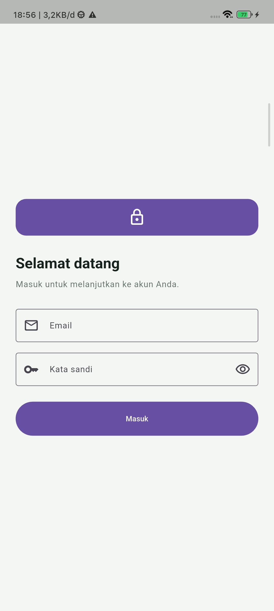
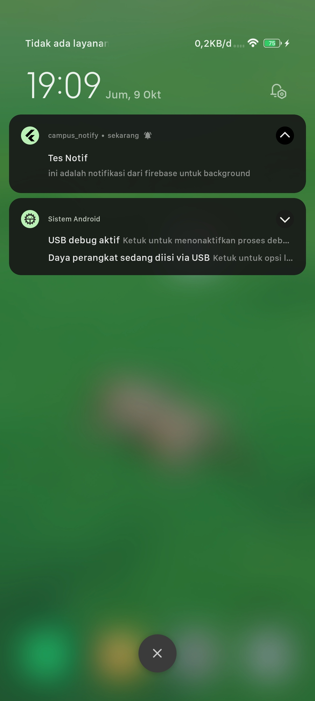
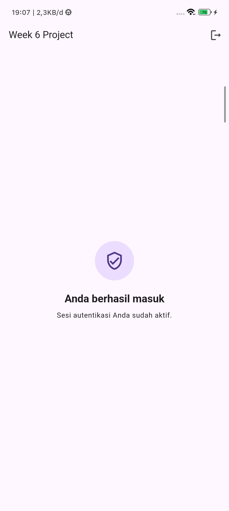
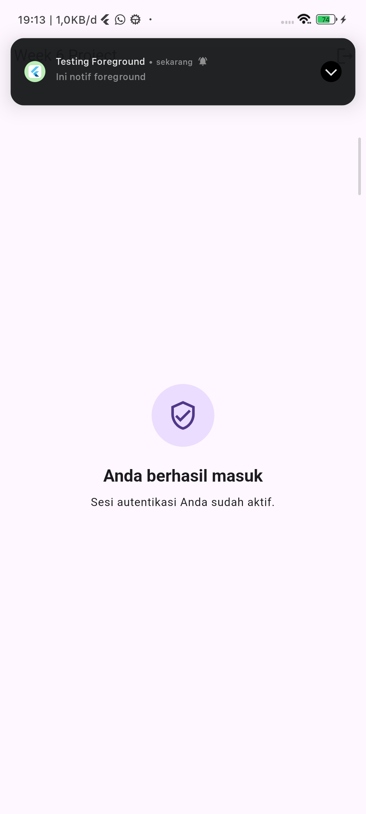

|            | Pemrograman Mobile                                                                                               |
| ---------- | ---------------------------------------------------------------------------------------------------------------- |
| NIM        | 244107020027                                                                                                     |
| Nama       | Muhammad Rayhan Zamzami                                                                                          |
| Kelas      | TI - 3G                                                                                                          |
| Repository | [link] (https://github.com/mrayhanz/244107020027-mobile-course/tree/main/06-week-6-authentication-security-form) |

# WEEK 6

## Authentication, Security & FCM

### HASIL PRAKTIKUM

### REFLEKSI

1. Alasan Refresh Token Tidak Boleh Disimpan di SharedPreferences & Risikonya
   SharedPreferences menyimpan data secara mentah tanpa lapisan proteksi enkripsi. Pada gawai yang telah di-root atau terinfeksi malware, berkas XML tersebut sangat gampang diekstraksi. Jika refresh token bocor, penyerang leluasa memproduksi access token valid secara berkala untuk mengambil alih sesi akun korban secara permanen tanpa perlu tahu kredensial aslinya.

2. Dampak Mengabaikan onTokenRefresh Selama Satu Semester
   Token FCM tidak permanen dan sewaktu-waktu diganti oleh Google, misalnya akibat pembaruan sistem atau pembersihan data aplikasi. Jika pembaruan ini tidak dipantau lewat onTokenRefresh, endpoint kampus tidak akan menerima token pembaruan. Dampaknya, pengiriman push notification ke mahasiswa macet total karena server terus menembak ke token kedaluwarsa.

3. Penggunaan Topik vs. Token Perangkat

Topik (Topic Messaging): Tepat untuk siaran massal ke segmen pengguna yang berminat pada kategori informasi yang sama.

Contoh: Edaran penutupan kampus saat libur nasional atau jadwal pengisian KRS serentak.

Token Perangkat (Direct Device Token): Khusus untuk informasi individual, rahasia, dan langsung menyasar satu gawai.

Contoh: Peringatan tunggakan UKT atau notifikasi validasi revisi skripsi oleh dosen pembimbing.

4. Koreksi pada Draf AI
   Bagian yang diubah adalah penanganan navigasi pada background message handler. Rancangan awal AI mencoba mengakses state management dan BuildContext langsung dari fungsi latar belakang. Logika tersebut dibongkar dan dipindahkan ke siklus aplikasi utama, mengingat handler latar belakang berjalan pada isolate terisolasi yang tidak memiliki konteks antarmuka. Alamat peladen boilerplate juga disesuaikan ke rute API proyek kampus yang sesungguhnya.
